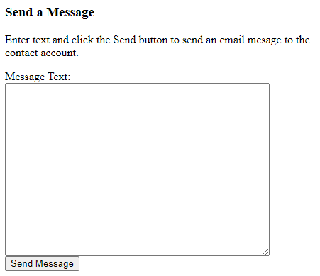

ContactForm
===========

A simple web contact form to allow visitors to send an email to a contact address without publishing that address publically.

To see it in action:

	1. Open the file MessageEmailAddressToSendTo.php in a text editor.
	2. Change the value assigned to the $emailAddressToSend variable.
	3. Save.
	4. Copy the contents of the Source directory to the desired location on a web server that runs PHP.
	5. Visit the appropriate URL in the browser.

Make sure that the web server is configured to execute PHP, or else the specified email address will be exposed to the internet at large.